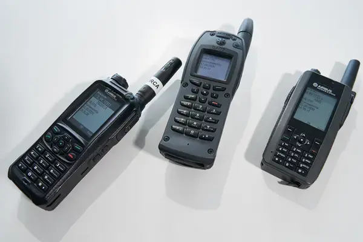
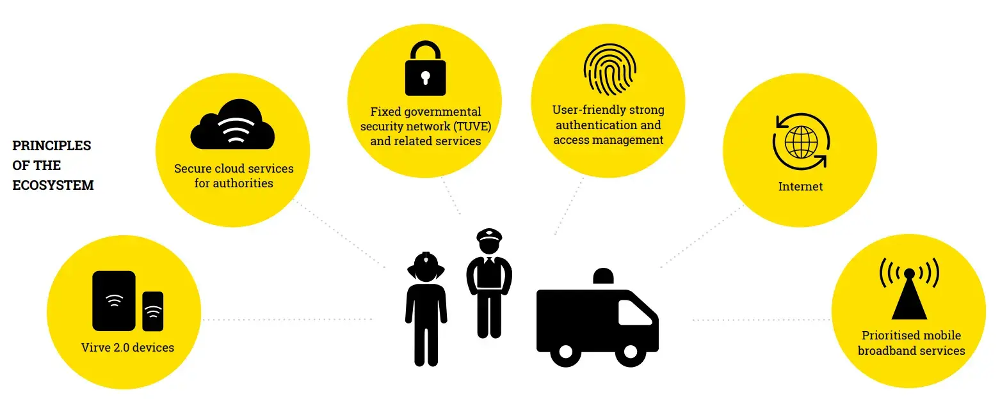

En cualquier situación de emergencia es necesario disponer de un robusto sistema de comunicaciones. La posibilidad de realizar una comunicación instantánea, fiable y estable es esencial para la toma de decisiones y así poder restaurar el estado de normalidad lo antes posible.

Las diversas agencias (bomberos, médicos, policía, etc.), en una situación de emergencia, necesitan poder confiar en las comunicaciones y disponer de conectividad. Estas comunicaciones no pueden verse degradadas por una situación de emergencia y deben estar disponibles para garantizar la comunicación y la coordinación de todos los intervinientes.

Para satisfacer esta demanda, tradicionalmente se ha hecho uso de las redes PMR (Private Mobile Radio), que con el tiempo han evolucionado de antiguos sistemas analógicos a modernos sistemas digitales como DMR, TETRA, TETRAPOL o P25.

En la actualidad ya no basta con garantizar la comunicación por voz; es esencial, pero cada vez es más necesario disponer de capacidades adicionales como la transmisión de imágenes en tiempo real, la transferencia de archivos o el acceso a sistemas TI durante la emergencia.

Los actuales sistemas PMR carecen de estas capacidades, y aquí es donde las futuras redes 5G, con sus capacidades de Misión Crítica (MC), pueden marcar la diferencia.

### Virve 2.0: la red 4G/5G finlandesa para servicios de emergencia

Por decisión del Comité Ministerial de Política Económica de Finlandia, la actual red de emergencias VIRVE, basada en tecnología TETRA, evolucionará hacia una nueva tecnología basada en 5G, con el objetivo de estar lista en 2026.

La razón por la que se ha decidido migrar de la actual tecnología TETRA a 5G está basada en los mismos principios que comentábamos en el punto anterior: los servicios de emergencia demandan cada vez más sistemas de acceso de banda ancha para satisfacer sus necesidades en una emergencia. Ya no basta con los tradicionales sistemas de voz PTT (Push to Talk); ahora, más que nunca, es necesario acceder a sistemas de transmisión de vídeo en tiempo real y a sistemas de información (bases de datos, aplicaciones, etc.), y los actuales sistemas PMR no son capaces de satisfacer esa demanda.

La nueva red, llamada VIRVE 2.0, se basa en un modelo en el que una empresa 100% propiedad del gobierno finlandés actúa como operador de servicios de telecomunicaciones, brindando a todas las agencias el acceso a la red.

Para el diseño de la red se han seguido las especificaciones MOCN (Multi-Operator Core Network) del 3GPP. La empresa propiedad del gobierno tendrá plena responsabilidad del "core" de la red, con responsabilidad total sobre la entrega del servicio E2E (end-to-end). De esta forma, y a diferencia de otros países, la red no está gestionada y controlada por una empresa privada, sino que es propiedad del gobierno, y este designa a un operador para la parte RAN (Radio Access Network).

### Piloto Broadway en Málaga (España)

Enmarcado en el proyecto Broadway, en España se realizó un simulacro de emergencias en el que se llevó a cabo el rescate de un ferry. En este simulacro se coordinaron diferentes agencias como Policía Local, Policía Nacional, Policía Portuaria, Guardia Civil, Bomberos, Protección Civil, 061 y SAS.

En este simulacro se quiso poner a prueba la tecnología móvil denominada "Broadband Mission Critical Mobile System".

Este tipo de pruebas trata de validar escenarios como los descritos anteriormente, donde la tecnología 5G puede aportar grandes ventajas.

### Seguridad de las redes MC (Mission Critical)

En el caso expuesto en este artículo, una red 5G de emergencias, se trata de reemplazar los sistemas actuales PMR por una red 5G. La incorporación de la red 5G implica también la incorporación de nuevos dispositivos de comunicaciones; en el caso que representa este artículo, se reemplazarían los terminales TETRA por dispositivos móviles con sistema operativo Android.

Sin entrar a debatir la seguridad de la propia red, podemos analizar cuáles son los riesgos que supone la incorporación de estas tecnologías en un sistema de misión crítica. A continuación se detallan algunos elementos que se incorporarían a la red y que pueden suponer un riesgo si no se gestionan adecuadamente:

* Incorporación de terminales con SO Android.
* Instalación de aplicaciones en los terminales Android.
* Actualizaciones de terminales y aplicaciones vía OTA (Over the Air).
* Conectividad de accesorios vía Bluetooth y USB-C.
* Acceso a aplicaciones alojadas en cloud (Edge Computing).
* Servicios basados en IP.
* Entorno mixto: red de comunicaciones (PTT) junto con acceso a sistemas y aplicaciones cloud.

Desde el punto de vista de la ciberseguridad tradicional, se debería tener en consideración que la incorporación de estas tecnologías supone, en sí misma, un riesgo que se debe gestionar. Por lo tanto, es necesario diseñar controles de seguridad para evitar que estos elementos puedan convertirse en un incidente de seguridad.

#### Seguridad por diseño

A la hora de evaluar las soluciones tecnológicas que complementan las comunicaciones de voz tradicionales (PTT), habrá que diseñar una política de seguridad basada en estándares reconocidos. Para cada uno de los elementos mencionados anteriormente se podrán aplicar controles de seguridad y sistemas de monitorización adecuados para garantizar la seguridad.

## Conclusión

Cuando hablamos de seguridad en redes 5G hay que tener en cuenta varios aspectos: por un lado, la propia seguridad de la red; por otro, el caso de uso concreto donde dicha red se va a desplegar, ya que, dependiendo del escenario, aplicarán políticas más o menos estrictas.

Además de la propia red, y de su escenario, habrá que tener en consideración aquellos aspectos tecnológicos que la rodean. En este artículo hemos visto cómo el reemplazo de los equipos PMR actuales se haría con dispositivos móviles Android, lo que implica que estos deben gestionarse y securizarse adecuadamente, como se haría en una organización (quizás con el uso de un MDM).

No solo existen los riesgos derivados del uso de los dispositivos o de las aplicaciones; en este caso concreto estamos hablando también de acceso a Internet y a aplicaciones alojadas en cloud, lo que supone también un riesgo a gestionar y que debe ser evaluado para aplicar correctamente políticas de seguridad.

En definitiva, la seguridad de las redes 5G no solo va a depender de la propia arquitectura, sino de los elementos que la componen.

#### Referencias

* [Sistema de Comunicaciones TETRA de Radioaficionados](https://es.linkedin.com/pulse/sistema-de-comunicaciones-tetra-radioaficionados-aliaga-casanova-)
* [PDF - Virve 2.0 mobile strategy](https://www.erillisverkot.fi/uploads/2020/11/erilisverkot_mobile_strategy_eng091020.pdf)
* [PDF - Virve 2.0 Request for Information](https://www.erillisverkot.fi/uploads/2021/03/erillisverkot-virve-2.0-devices-rfi-summary-of-responses-february-2021.pdf)

#### Serie: Ciberseguridad en 5G

* [Parte I: Introducción]()
* Parte II: Redes de Misión Crítica (este artículo)
* [Parte III: NFV, SDN y arquitectura basada en servicios]()
* [Parte IV: La nube táctica y el 5G en Defensa]()
* [Parte V: La evolución de las redes de emergencias hacia el 5G]()
