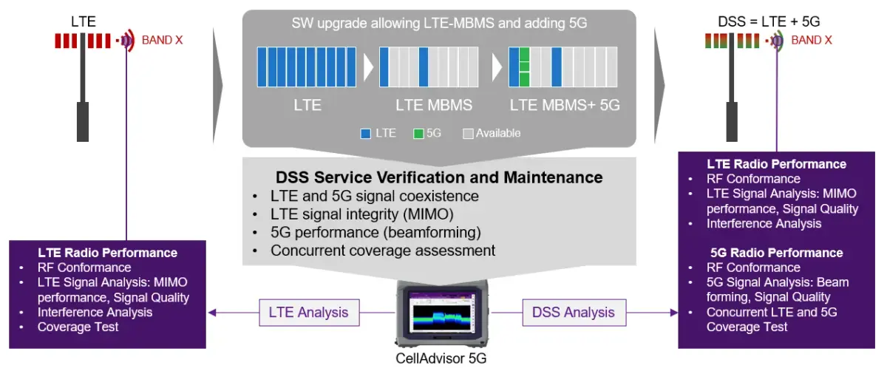
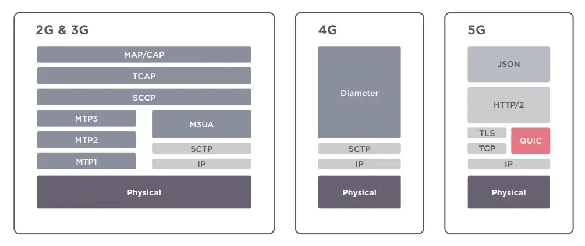
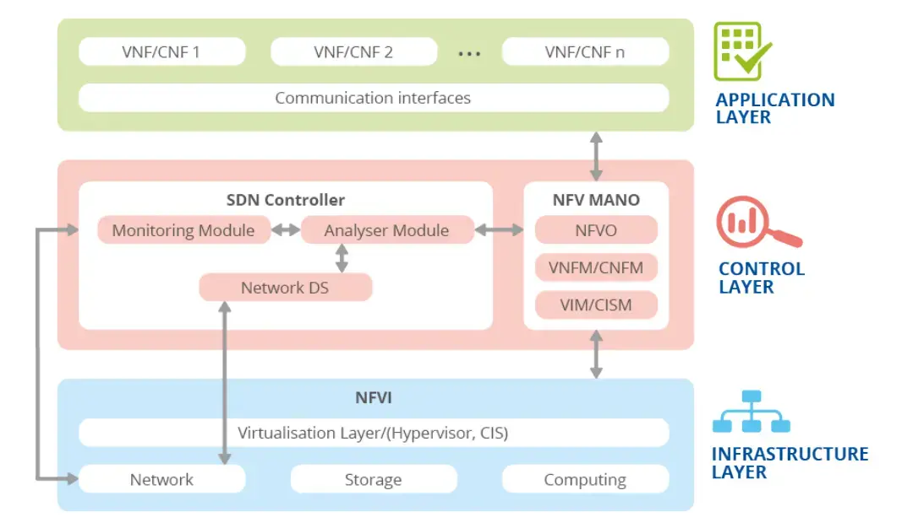

Continuamos con la saga de artículos sobre seguridad 5G. En esta entrega hablaremos de los retos de seguridad que supone la incorporación de NFV, SDN, entre otras tecnologías.

La implantación de una red 5G no está exenta de cambios en la parte de red. El potencial número de dispositivos que acabarán conectándose a dicha red requiere de tecnologías avanzadas, tanto en la parte radio como en el core de la red, para gestionar ese volumen de dispositivos.

### Coexistencia de redes 4G y 5G

Conseguir que una red de telecomunicaciones evolucione hacia la última tecnología no es sencillo, y esto se debe a la complejidad que implica la migración hacia sistemas más modernos: son cambios que no se pueden producir de la noche a la mañana en entornos donde la disponibilidad y la fiabilidad son claves.

Durante mucho tiempo las redes 4G coexistirán con las redes 5G. De hecho, es lo que está sucediendo actualmente, donde podemos ver despliegues de redes 5G con DSS (Dynamic Spectrum Sharing).

#### 5G DSS

Durante los últimos años, las operadoras han ido actualizando los equipos de radio, convergiendo hacia equipos SDR (Software Defined Radio), de forma que pueden actualizarse remotamente y empezar a trabajar con 5G NR sin que sea necesaria la intervención física. Actualmente, un reemplazo directo de la red 4G por una red 5G dejaría a muchos usuarios sin servicio, ya que no todo el parque de terminales tiene compatibilidad con 5G.

Aquí es donde entra en juego el DSS: muy resumidamente, y sin entrar en gran detalle técnico, lo que hace es intercalar la señal 4G LTE con una señal 5G NR en la misma frecuencia. Se trata de una solución necesaria para empezar a migrar bandas antiguas hacia el 5G sin dejar de dar servicio a usuarios con terminales obsoletos.

La utilización de este tipo de tecnologías implica que la evolución no será uniforme en todos los países. En algunos se podrá migrar directamente de redes 4G a 5G NSA sin pasar por despliegues intermedios, pero en otras zonas geográficas el paso de una tecnología a otra implicará pasos intermedios, como la adopción de 5G DSS o la coexistencia de 4G y 5G. Esta situación de coexistencia de las redes supone un reto para la seguridad de las mismas.

### Incorporación a las redes 5G de tecnologías y protocolos de Internet

Las redes móviles de generaciones anteriores se basaban en protocolos como SS7 (Signaling System 7) y Diameter, entre otros. La evolución de las redes conlleva también una evolución en los protocolos que se usan: las redes 5G se basan en protocolos y tecnologías conocidas en Internet, como la virtualización, SDN, HTTP/2 y TLS, entre otros.

Este cambio no solo significa una evolución, sino que también implica una serie de riesgos. Aunque se ha demostrado todo lo contrario, existía la creencia de que, al usar protocolos cerrados como SS7 o Diameter, las redes serían más seguras.

Evidentemente esto no ha sido así, y hay muchos ataques que se han realizado contra la red SS7, poniendo en peligro la seguridad de las redes de los operadores; a continuación se muestran algunos enlaces que demuestran las vulnerabilidades de estos protocolos:

* [ptsecurity.com/ww-en/analytics/ss7-vulnerability-2018](https://www.ptsecurity.com/ww-en/analytics/ss7-vulnerability-2018/)
* [ptsecurity.com/ww-en/analytics/diameter-2018](https://www.ptsecurity.com/ww-en/analytics/diameter-2018/)
* [ptsecurity.com/ww-en/analytics/corp-vulnerabilities-2019](https://www.ptsecurity.com/ww-en/analytics/corp-vulnerabilities-2019/)

Quizás la adopción de estos protocolos y tecnologías ampliamente conocidos suponga que se den situaciones más beneficiosas para los atacantes, ya que estos pueden explotar vulnerabilidades conocidas en Internet, así como acceder a herramientas que les permitan explotarlas.

### Virtualización y cloud en redes 5G

No solo la adopción de protocolos usados comúnmente en Internet es algo a destacar en las redes 5G; la virtualización de sus componentes, junto con sus servicios, se ha definido como uno de los principales avances de las redes de comunicación de nueva generación.

Para ello se incorporan tecnologías como "Network Functions Virtualization" (NFV) junto con tecnologías SDN (Software Defined Networks), que tienen como objetivo administrar de forma dinámica y más eficiente la red del operador.

#### SBA (Software Based Architecture)

Comparado con versiones anteriores, la arquitectura del sistema 3GPP 5G está basada en servicios (SBA). Esto significa que, siempre que sea posible, los elementos de la arquitectura se definen como funciones de red que ofrecen sus servicios a través de un marco común (framework) hacia el resto de redes.

#### Arquitectura NFV

La virtualización de elementos de red, o NFV, es un concepto que permite virtualizar los servicios de red que, tradicionalmente, se ejecutan en hardware propio y exclusivo. Con NFV, funciones como el enrutamiento, el balanceo de carga, los firewalls y otros elementos se ejecutan de forma virtual en un hipervisor.

Este concepto no es nuevo: fue presentado originalmente por un grupo de proveedores de servicios en el Congreso Mundial de SDN y OpenFlow, en octubre de 2012. El objetivo era simplificar y acelerar el proceso de agregar nuevas funciones o aplicaciones de red.

La arquitectura NFV de una red 5G implica la introducción de nuevos procesos, actividades y operaciones. Esto implica la aparición de nuevos actores y proveedores que intervienen en el funcionamiento, la administración y el mantenimiento de la red.

#### Ciberseguridad alrededor del NFV en 5G

A pesar de los retos potenciales debido al uso de tecnologías recientes como NFV y SDN en las redes 5G, no solo podemos pensar que abren puertas a posibles riesgos: también debemos mirar la otra cara de la moneda y considerar estas tecnologías como habilitadoras para mejorar la seguridad de las redes 5G. A continuación se muestran algunas oportunidades que se abren con la incorporación de estas tecnologías:

* **Incremento de la automatización**: a través de la capa de gestión y orquestación (MANO) se podrían automatizar los controles y mitigaciones de seguridad. De aquí se desprende la necesidad de registrar los eventos de seguridad, supervisar toda la infraestructura, la detección, la verificación de integridad, la gestión de parches y otras acciones.
* **Segmentación y creación de zonas**: mediante la orquestación, determinados NFV pueden desplegarse en VMs o contenedores que pueden segregarse mediante redes separadas. Esto implica que, por ejemplo, se puedan aplicar conceptos de seguridad en profundidad a estos despliegues, así como principios de supervisión, monitorización y respuesta frente a incidentes de seguridad.

Además de lo mencionado anteriormente, habrá que prestar especial atención a la gestión de los parches de seguridad (patch management) y a la gestión centralizada del tráfico mediante el uso de SDN, permitiendo detectar anomalías sobre el mismo y predecir cambios en la arquitectura para, por ejemplo, evitar ataques DDoS.

## Conclusión

Como conclusión, podemos indicar que la incorporación de tecnologías como NFV y SDN abre una ventana a nuevos riesgos, al igual que también es una oportunidad única de mejorar la seguridad de las redes 5G aplicando algunas de las mejores prácticas usadas en entornos TI.

Pero no solo NFV y SDN son tecnologías que se incorporan a este tipo de redes. Otras tecnologías, como el cloud computing, los microservicios, la virtualización (uso de diversos hipervisores) o los contenedores, hacen necesario poner el foco en mejorar la seguridad de dichos elementos de la red, sin dejar de lado el propio protocolo, donde se ha demostrado que, a día de hoy, aún existen algunas vulnerabilidades que deben parchearse.

En los siguientes artículos iremos viendo poco a poco qué elementos forman parte de estas redes, y en sucesivas entregas analizaremos los riesgos y los controles de seguridad que se pueden aplicar, como ZTNA (Zero Trust Network Architecture) o el análisis del tráfico y la detección de anomalías mediante IA.

### Referencias

* [Estrategia de Impulso de la tecnología 5G](https://espanadigital.gob.es/sites/espanadigital/files/2022-06/Estrategia%20de%20Impulso%20a%20la%20Tecnolog%C3%ADa%205G.pdf)
* [ESF Potential Threats to 5G network slicing](https://media.defense.gov/2022/Dec/13/2003132073/-1/-1/0/POTENTIAL%20THREATS%20TO%205G%20NETWORK%20SLICING_508C_FINAL.PDF)
* [5G Security White Paper by ZTE](https://res-www.zte.com.cn/mediares/Policy/Files/ZTE_5G_Security_White_Paper.pdf)
* [PDF - Seguridad en Redes 5G](https://www.5gamericas.org/wp-content/uploads/2021/12/Security-in-5G.pdf)
* [PDF - ENISA NFV Security in 5G](https://www.enisa.europa.eu/publications/nfv-security-in-5g-challenges-and-best-practices)

### Serie: Ciberseguridad en 5G

* [Parte I: Introducción]()
* [Parte II: Redes de Misión Crítica]()
* Parte III: NFV, SDN y arquitectura basada en servicios (este artículo)
* [Parte IV: La nube táctica y el 5G en Defensa]()
* [Parte V: La evolución de las redes de emergencias hacia el 5G]()
