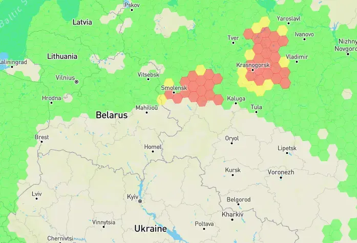
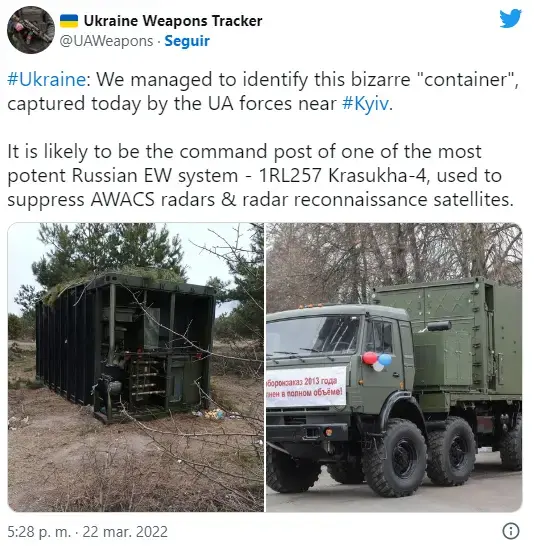

Como venimos indicando en esta saga de artículos ([I](), [II](), [III](), [IV]()), el spoofing de GPS ha emergido como una amenaza seria de la que muchos países y organizaciones están pendientes. Aunque las interferencias de GPS no son una novedad, sus efectos actuales han afectado gravemente a las operaciones de vuelo y a la seguridad tanto aérea como marítima.

Según el informe del *2024 GPS Spoofing Workgroup*, en enero de 2024 se registraban 300 vuelos diarios bajo los efectos de estas interferencias. Sin embargo, este número creció exponencialmente hasta alcanzar un promedio de 1.500 vuelos diarios afectados en agosto de 2024. Durante el período comprendido entre el 15 de julio y el 15 de agosto de 2024, un total de 41.000 vuelos experimentaron interferencias en sus sistemas de posicionamiento GPS.

No es una coincidencia que la mayor parte de los incidentes de spoofing GPS se concentren en zonas de conflicto: está asociado con el uso de sistemas militares para contrarrestar drones hostiles. Estos dispositivos, diseñados para engañar a los sistemas GPS de los drones, están afectando también a los sistemas civiles, en este caso a la navegación aérea y marítima. Sin embargo, no hay evidencia que sugiera que las aeronaves civiles estén siendo blanco directo de estos ataques.

Aunque no existen evidencias directas, se cree que entre los actores principales detrás de estas interferencias se encuentran unidades militares que emplean sistemas de spoofing para desviar la trayectoria de misiles guiados por GPS o para bloquear drones hostiles.

### Zonas afectadas por el spoofing GPS

Las áreas más afectadas por el spoofing se encuentran principalmente en el este del Mediterráneo, donde países como Israel, Líbano, Chipre y Egipto han experimentado una alta frecuencia de interferencias. Otras áreas incluyen el Mar Negro, Rusia occidental, Ucrania y la frontera entre India y Pakistán.

En el caso del Mediterráneo oriental, la FIR (Región de Información de Vuelo) de Nicosia es la más afectada de todo el mundo. El spoofing ha causado desvíos inesperados en los vuelos que aterrizan en el aeropuerto de Beirut (OLBA) y en Larnaca (LCLK), provocando problemas con la alineación del sistema de referencia inercial (IRS) y generando frecuentes go-arounds.

Si seguimos investigando, [GPSJam](https://gpsjam.org/) ha detectado, en repetidas ocasiones, una gran cantidad de interferencias en las señales GPS muy cerca de la frontera de Rusia con Ucrania. Y no solo hace meses, sino de forma continuada, tal y como se puede observar consultando su sitio web.

Conforme avanza el conflicto se ha observado un aumento de estas interferencias. Desde diciembre, grandes áreas del país se han enfrentado a interferencias de forma continua y generalizada, según informa GPSJam.

### Capacidades rusas de guerra electrónica

La guerra de Ucrania nos deja muchos análisis que realizar, a tenor de las noticias que van apareciendo en todos los medios, y está sirviendo como referente para aprender de los modernos conflictos bélicos, donde prima por encima de todo la tecnología.

Durante este conflicto, el ejército ruso ha demostrado tener grandes capacidades de guerra electrónica (EW). Es bien sabido por los expertos que Rusia tiene un arma especialmente diseñada para la interferencia de señales: el Krasukha-4, un sistema de guerra electrónica transportable que viaja en un camión 8x8 modelo Kamaz-6350. Según el investigador del Centro Internacional de Defensa y Seguridad de Estonia (ICDS) Martin Hurt, los primeros modelos fueron entregados al ejército ruso en 2013.

## Desplegando más sistemas para perturbar las señales GPS

Otros de los sistemas que se están viendo afectados por el jamming de las señales GPS son los sistemas AIS (Sistema de Identificación Automática), usado para alertar de la posición de los barcos de más de 300 toneladas, junto a datos sobre su identidad, rumbo y velocidad.

Varios investigadores, usando fuentes de información abiertas (OSINT), han observado posiciones incorrectas de barcos alrededor de la boya rusa nº 133, ubicada en el mar Negro. Uno de los analistas, conocido como [@CovertShores](https://x.com/CovertShores), publicaba en la red social X que se observaban movimientos extraños de barcos en la zona, posiblemente debidos a las perturbaciones de las señales GPS reflejadas en la web de seguimiento del tráfico marítimo marinetraffic.com.

### Medidas para mitigar el impacto de estos sistemas de perturbación de señales GPS

El aumento de las interferencias y los ataques de spoofing GPS ha impulsado el desarrollo de diversas soluciones tecnológicas para mitigar este problema. A continuación, se detallan algunas medidas clave que pueden ayudar a proteger los sistemas de navegación y asegurar la integridad de las señales GPS.

Diversos fabricantes y agencias están trabajando en mejorar las antenas de recepción de las señales GPS, para que se conviertan en antenas activas capaces de "anular" las interferencias al mismo tiempo que discriminan qué señales son fiables y cuáles no.

Otra de las medidas que se está barajando es la integración de sistemas inerciales en los receptores GNSS, para proporcionar información más precisa sobre altitud, velocidad y posición. La combinación de sistemas inerciales con sistemas GNSS puede ser una alternativa viable para periodos cortos de perturbación de las señales.

También se empieza a barajar el uso de receptores capaces de combinar diversas frecuencias y constelaciones de sistemas GNSS (GPS, Galileo, GLONASS, BeiDou), reduciendo la probabilidad de que todos estos sistemas sean perturbados de forma simultánea. Aunque un atacante, en teoría, podría interferir todas las frecuencias usadas por estas constelaciones.

## Conclusión

Las medidas para mitigar las interferencias y ataques de spoofing requieren una combinación de tecnologías y de múltiples constelaciones GNSS. Adoptar un enfoque en capas, combinando varias de estas soluciones, es la mejor estrategia para enfrentar los desafíos del spoofing y el jamming.

A día de hoy podemos ver a los ejércitos usando armas de guerra electrónica (EW) para interferir las señales GPS. Esperemos que no sean, en un futuro, otros actores maliciosos los que usen sistemas capaces de perturbar las señales de los sistemas GNSS, con las consecuencias que ello supondría, tal y como se ha ido observando a lo largo de esta serie de artículos.

### Referencias

* [GPS Signals being disrupted over Russia's territory to prevent the attacks of Ukraine](https://mil.in.ua/en/news/gps-signals-being-disrupted-over-russia-s-territory-to-prevent-the-attacks-of-ukraine/)
* [GPS Signals are being disrupted in Russian Cities](https://www.wired.com/story/gps-jamming-interference-russia-ukraine/)

### Serie: Incidentes de seguridad en sistemas GNSS

* [Parte I: Introducción a las amenazas GNSS]()
* [Parte II: Incidentes marítimos, militares e infraestructuras críticas]()
* [Parte III: GPS spoofing en el Golfo Pérsico y la navegación marítima]()
* [Parte IV: GPS jamming en zonas de conflicto y monitorización global]()
* Parte V: El repunte del spoofing GPS en 2024 (este artículo)
* [Parte VI: Guerra electrónica en Ucrania e Israel]()
