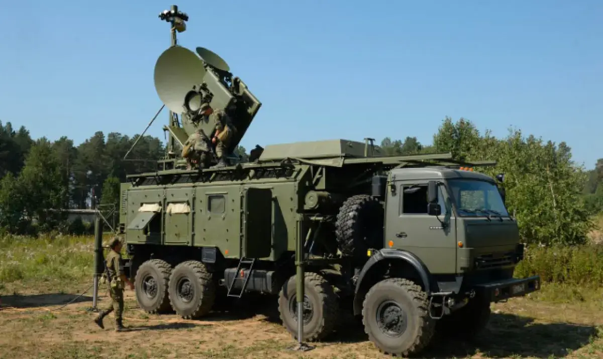
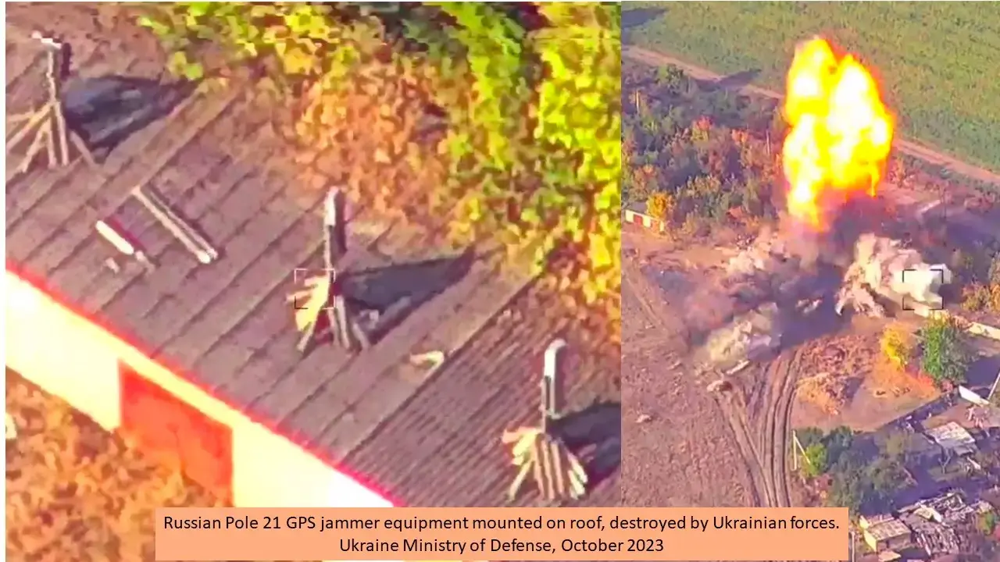
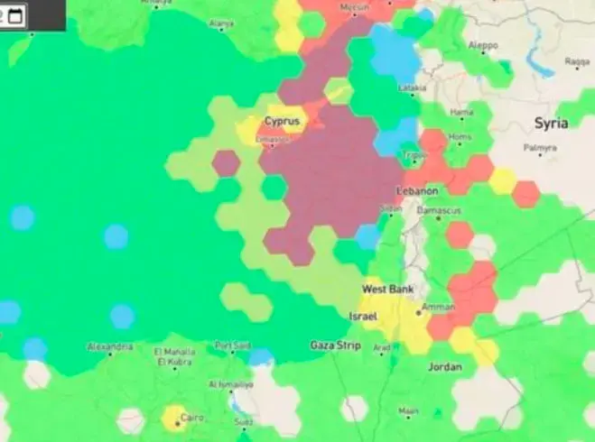
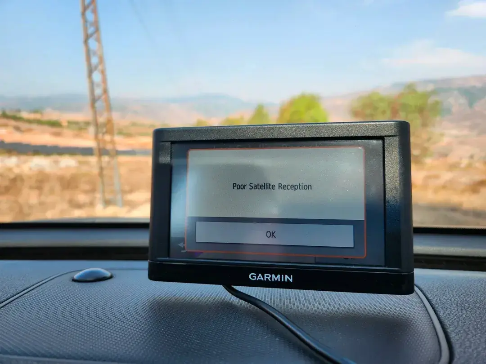

Como se ha podido ver en los anteriores artículos ([I](), [II](), [III](), [IV](), [V]()), los ataques de jamming y spoofing han ido creciendo cada vez más en los últimos años, hasta el punto de que, desgraciadamente, han llegado a afectar a sistemas críticos como el control de tráfico aéreo, la navegación marítima, la agricultura de precisión y los servicios de emergencia, entre otros.

## Conflicto bélico como escenario de pruebas de estos sistemas

En pleno siglo XXI, en el corazón de Europa, varios países se encuentran inmersos en una guerra convencional, o realmente no tan convencional como quisiéramos pensar. Este conflicto se ha convertido en un escenario donde la guerra electrónica (EW) juega un papel fundamental.

Una de las cosas de las que se puede estar seguro en la guerra entre Ucrania y Rusia es que uno u otro bando está interfiriendo las comunicaciones y los sistemas de navegación por satélite del otro. Una consecuencia aparente es que es probable que se produzcan "desbordamientos" hacia zonas adyacentes.

Según [diversos informes](https://www.forbes.com/sites/davidaxe/2023/10/31/the-russians-installed-a-gps-jammer-in-ukraine-the-ukrainians-blew-it-up-with-a-gps-guided-bomb/), las fuerzas rusas siguen haciendo uso de sus sistemas de guerra electrónica para perturbar las señales de los sistemas GNSS. En el teatro de operaciones se ha podido ver desplegado su sistema de interferencia POLE-21, diseñado en principio para proteger activos e infraestructuras críticas.

Este sistema de guerra electrónica fue desarrollado en el Centro Científico y Técnico de Guerra Electrónica (STC REB) para ser adoptado en 2016 por el ejército ruso. Además del sistema POLE-21 existe una versión mejorada, la POLE-21M, y una versión de exportación llamada POLE-21E. Según información publicada por [TOPWAR](https://en.topwar.ru/182196-kompleksy-rjeb-pole-21-v-rossijskoj-armii.html), cada módulo es capaz de perturbar señales en un radio de al menos 25 km, con una potencia de transmisión de entre 300 y 1000 W.

Las fuerzas armadas rusas llevan mucho tiempo priorizando la guerra electrónica, y el teatro de operaciones se ha convertido en el mejor banco de pruebas de las tecnologías de perturbación de señales. En 2017, el Ministerio de Defensa de Estonia destacaba que Moscú empezaba un programa de modernización de sus activos de guerra electrónica, algo que evidentemente está teniendo efecto y demostración en el actual conflicto con Ucrania, donde los sistemas de EW forman parte orgánica de las operaciones cinéticas y no cinéticas de Rusia.

Tanto es así que en algunos vídeos se puede observar cómo, supuestamente, las fuerzas ucranianas abaten un sistema de jamming POLE-21 ruso en la región de Zaporiyia.

El conflicto armado entre Rusia y Ucrania no es el único punto en el que se están observando técnicas de EW para la perturbación de señales GNSS: también se pueden observar casos similares en el conflicto de Israel con Hamás.

### Jamming en Israel

En el escenario del conflicto entre Israel y Hamás, el uso estratégico de sistemas de guerra electrónica con capacidad de interferir los sistemas GNSS se ha convertido en un factor importante, como ya lo es en el conflicto entre Rusia y Ucrania.

Cuando comenzaron las hostilidades, Hamás empleó sistemas para perturbar las señales GNSS, tratando de impedir que funcionasen con normalidad las redes de comunicación israelíes. En el otro bando, Israel intensificó su propio uso de sistemas de guerra electrónica para interferir las señales GNSS con el fin de neutralizar las amenazas aéreas de los drones y protegerse de los ataques aéreos.

Con tanta actividad de sistemas de guerra electrónica tratando de interferir las señales GNSS, el tráfico aéreo se ha visto afectado. La mayor parte del tráfico de aviones comerciales que vuelan al aeropuerto internacional Ben Gurión se ve afectado significativamente, ya que los vuelos cruzan desde el Mediterráneo por encima de la costa. Para continuar con las operaciones aéreas son necesarias rutas de vuelo más largas hacia el sureste de Israel, probablemente basándose en puntos de ruta de estaciones terrestres VOR y DME antes de volver hacia el noroeste para captar el sistema de aterrizaje por instrumentos (ILS). Esto cuesta tiempo y combustible, y hace que los aviones sobrevuelen asentamientos donde el ruido puede ser un problema real.

Estas actividades persistentes de interferencia de los sistemas GNSS reflejan que la guerra electrónica es un componente crítico en las operaciones militares modernas. El problema es que el sistema GNSS no solo se usa para fines militares, sino que también es ampliamente usado por la sociedad civil, por lo que su interrupción tiene grandes implicaciones tanto para el ámbito militar como para el civil.

## Cuando el GNSS no funciona: impacto en la sociedad

El GNSS, como hemos visto, es altamente "adictivo": lo hemos incluido en una gran cantidad de rutinas de nuestras vidas. Quienes seguís esta serie de artículos habréis podido comprobar las vulnerabilidades que tiene este sistema y, probablemente, las preocupaciones que puede suscitar en gobiernos y agencias nuestra dependencia de él.

No hace mucho, en la comunidad de Reddit r/Garmin, un usuario que estaba viajando por Israel reportaba problemas con su terminal GPS Garmin.

La amenaza es real y presente. El ejemplo del usuario de Reddit quizás no tenga un impacto muy alto, pero la afectación a la sociedad es real: tanto es así que estos incidentes llegaron a cerrar una pista de un aeropuerto en octubre de 2022. Por esta razón, el Departamento de Seguridad Nacional de EE. UU. identificó, en un informe, que 15 de los 18 sectores que contienen infraestructuras críticas son vulnerables a fallos en los sistemas GNSS, entre ellos:

* Sistemas de comunicaciones
* Servicios de emergencias
* Sistemas IT
* Banca y finanzas
* Sistemas de salud
* Sector energético y sus redes de distribución

## Conclusión

Aunque los riesgos son conocidos y los incidentes cada vez afloran más a la luz, es un riesgo que no siempre se tiene en cuenta, y que empieza a tener impacto en las empresas y la sociedad. Existen proyectos y empresas que están trabajando en soluciones que, si bien no son excesivamente caras, no son gratuitas y solo están disponibles bajo licencia.

¿Tendremos en el futuro un nuevo panorama en el que debamos aceptar que el PNT (Positioning, Navigation and Timing) ya no es gratuito? No lo sabemos, pero tendremos que ver cómo evoluciona todo alrededor de la seguridad de los sistemas GNSS.

### Referencias

* [GPS Signals being disrupted over Russia's territory to prevent the attacks of Ukraine](https://mil.in.ua/en/news/gps-signals-being-disrupted-over-russia-s-territory-to-prevent-the-attacks-of-ukraine/)
* [GPS Signals are being disrupted in Russian Cities](https://www.wired.com/story/gps-jamming-interference-russia-ukraine/)
* [Ukraine Spoofing Russian Drones Out Of The Sky (Forbes)](https://www.linkedin.com/pulse/ukraine-spoofing-russian-drones-out-sky-forbes-dana-a-goward/)
* [Russian E-War System Likely Behind Ben Gurion Disruptions](https://www.israeltoday.co.il/read/russian-e-war-system-likely-behind-ben-gurion-disruptions/)

### Serie: Incidentes de seguridad en sistemas GNSS

* [Parte I: Introducción a las amenazas GNSS]()
* [Parte II: Incidentes marítimos, militares e infraestructuras críticas]()
* [Parte III: GPS spoofing en el Golfo Pérsico y la navegación marítima]()
* [Parte IV: GPS jamming en zonas de conflicto y monitorización global]()
* [Parte V: El repunte del spoofing GPS en 2024]()
* Parte VI: Guerra electrónica en Ucrania e Israel (este artículo)
