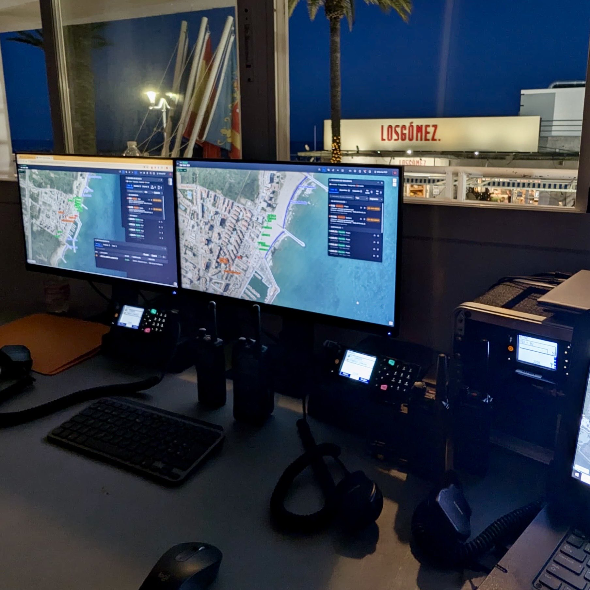

Un terremoto, una inundación, un incendio forestal, un apagón, una catástrofe de cualquier índole puede afectar a las infraestructuras de comunicaciones precisamente cuando son más necesarias.

Por eso, hablar de comunicaciones críticas no debería significar únicamente hablar de redes permanentes. Cada vez resulta más importante disponer de capacidades que puedan **desplegarse allí donde sean necesarias, durante el tiempo que sean necesarias y adaptándose a las necesidades de la operación**. Este tipo de infraestructuras llamadas IEN (Instant Emergency Networks) son vuelven fundamentales para poder poner en comunicación a los intervinientes en una emergencia.

En [Protección Civil Godella](https://www.instagram.com/pcgodella/) hemos llevado ese concepto a la operativa, experimentando y probando tecnologías para facilitar el despliegue de ese tipo de redes con el objetivo de demostrar la idoneidad de este tipo de infraestructuras que proporcionen conectividad desplegable a los servicios de emergencias.

Pero no somos los únicos, un ejercicio reciente realizado en Nueva Zelanda por SafetyNet Critical Communications evaluó diferentes aproximaciones para proporcionar conectividad desplegable a los servicios de emergencias, combinando una solución celular con una plataforma aérea basada en un dron cautivo.

## Medios aéreos para aumentar la cobertura

Las soluciones desplegables de comunicaciones celulares no es algo nuevo, los operadores disponen de CoW's (Cells on Wheels) que permiten llevar las comunicaciones allá donde la infraestructura permanente ha quedado dañada. Su tamaño y capacidad permiten cubrir grandes áreas pero, en ocasiones, nos encontramos ante un gran inconveniente, y es que las dimensiones de estas CoW's no permiten posicionarlas donde se necesita esa cobertura. Es aquí donde los sistemas UAV juegan un papel fundamental, su versatilidad para ser desplegados en pocos minutos, sumada a su capacidad de elevarse a una altura considerable, los hacen muy valiosos para expandir la cobertura de las redes celulares. Permiten situar sobre una plataforma de dron cautivo una estación de comunicaciones.

Situar una estación de comunicaciones a cierta altura puede modificar radicalmente las posibilidades de cobertura, especialmente en terrenos complejos, zonas rurales, áreas montañosas o escenarios donde, como decíamos antes, los medios convencionales no pueden llegar para desplegar soluciones de conectividad.

Además con el auge del 5G orientado a las emergencias, estas soluciones se posicionan como muy elegibles para este tipo de despliegues de infraestructuras de comunicaciones en emergencias. Pudiendo dotar no sólo de comunicaciones de voz (MCPTT) sino también acceso a aplicaciones y datos con un ancho de banda considerablemente alto.

Se ha demostrado que, hoy en día, una agencia de emergencias, ya no solo necesita el acceso a la voz (PTT), necesita poder comunicarse con otros equipos, transmitir información (audio, video, posicionamiento, etc.), acceder a sistemas GIS, enviar imágenes y vídeo en tiempo real, utilizar aplicaciones de misión critica y mantener todo eso operativo y accesible desde un Puesto de Mando (PMA).

## El futuro de las comunicaciones críticas

El futuro de las comunicaciones críticas probablemente no estará basado en una única tecnología.

TETRA seguirá teniendo un papel importante en determinados escenarios. LTE y 5G permiten incorporar capacidades de banda ancha que son difíciles de proporcionar con los sistemas tradicionales. Las redes comerciales pueden aportar cobertura y capacidad cuando están disponibles. Las redes desplegables permiten llevar infraestructura a zonas concretas. Los enlaces satelitales proporcionan backhaul cuando las comunicaciones terrestres no están disponibles. Y las plataformas aéreas pueden añadir una nueva dimensión.

## Conclusiones

Las **Instant Emergency Networks (IEN)** no deberían entenderse únicamente como una solución para recuperar las comunicaciones cuando la infraestructura convencional falla. Son una capacidad operativa que permite desplegar rápidamente conectividad, sistemas de información y servicios allí donde una emergencia los necesita.

Por eso es fundamental **experimentar, probar y validar estas tecnologías antes de que llegue la emergencia**. Las redes desplegables, los enlaces satelitales, las comunicaciones LTE/5G, las redes mesh o las plataformas aéreas plantean posibilidades muy interesantes, pero su verdadero valor solo puede comprobarse cuando se integran en escenarios operativos y se ponen a prueba bajo condiciones reales.

Y hay otro factor que resulta igualmente importante: **las personas**.

No basta con disponer de los equipos. Es necesario contar con profesionales y equipos de emergencia que tengan las capacidades necesarias para desplegarlos, configurarlos, integrarlos y operarlos. Una IEN requiere conocimientos de comunicaciones, redes, sistemas, ciberseguridad y, sobre todo, comprensión de las necesidades operativas de una emergencia.

En este sentido, iniciativas como la de **Protección Civil Godella** resultan especialmente interesantes. Una agrupación de voluntarios de Protección Civil que apuesta por experimentar con nuevas tecnologías y demostrar cómo las comunicaciones y los sistemas de información pueden convertirse en capacidades reales para la gestión de emergencias.

El objetivo no debería ser simplemente conseguir que exista conectividad en el lugar del incidente. El verdadero valor aparece cuando esa conectividad permite construir una **situational awareness** compartida y una **Common Operational Picture (COP)** que integre información procedente de diferentes fuentes y la ponga a disposición de quienes tienen que tomar decisiones.

Porque disponer de más información no significa necesariamente disponer de mejor información.

La información debe estar disponible en el momento adecuado, contextualizada y convertida en **información accionable**. Cuando esto se consigue, los responsables de la emergencia pueden comprender mejor qué está ocurriendo, dónde están los recursos, cuáles son las prioridades y cómo está evolucionando el incidente, facilitando una toma de decisiones más rápida y ágil.

Ese es, en mi opinión, uno de los grandes retos de las IEN: pasar de ser simplemente **redes desplegables** a convertirse en una verdadera **capacidad operativa para la gestión de emergencias**.

Experimentar, formar a las personas y probar estas capacidades sobre el terreno es la mejor manera de conseguirlo antes de necesitarlas.
